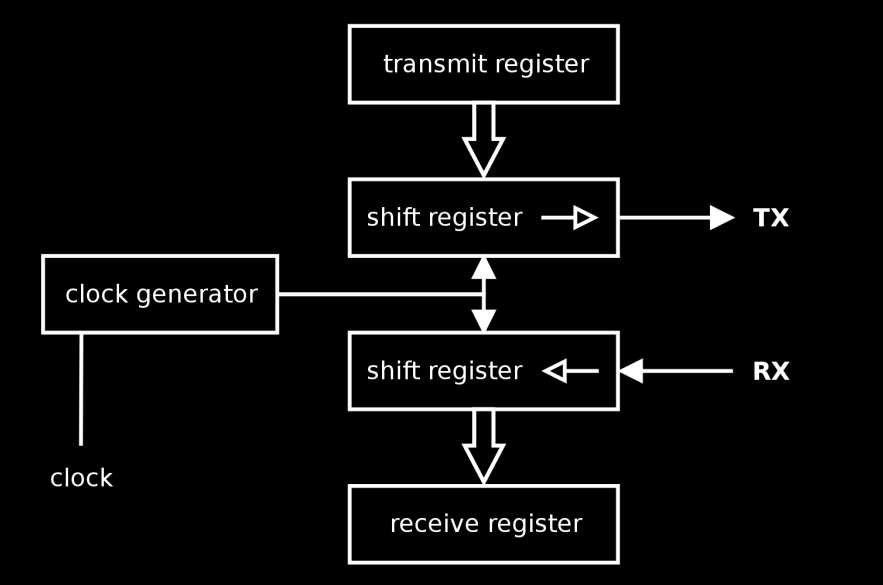

# Simplified_UART
CS_223 Digital Design Term Project  

UART implementation on Basys3 FPGA using SystemVerilog.  

Device consists of a transmitter and a receiver module with a configurable baud rate.  

<a href=https://github.com/mHuseyin0/Simplified_UART/blob/main/Term_Project.xpr>Project file</a> can be used
to load the project on Vivado.  

<a href=https://github.com/mHuseyin0/Simplified_UART/blob/main/Term_Project.runs/impl_1/UART.bit>Bitstream file</a> is up
to date and can be used to write UART on Basys3 FPGA.  

<ins>Features and Usage</ins>
* Both transmitter and receiver modules have 4 1-byte registers which can all be displayed on 7 segment display.
* Rightmost 8 switches determines the byte to be sent.
* Down button loads that byte to the transmitter register 0.
* Center button shifts all registers by 1 meaning t0 -> t1 -> t2 -> t3 -> r0 -> r1 -> r2 -> r3 where t is transmitter and r is receiver registers.
* There are 2 shift registers in the actual implementation one of which is after t3 and the other one is before r0. Those shift registers send and receive data 1 bit at a time according to the UART Protocol.
* t0 register does not change until a new value loaded.
* r3 register discards its value when the bytes are shifted.
* JA4: G2 pin is the output of transmission module.
* JA1: J1 pin is the input of reception module.
* Connecting those pins on a single Basys3 or 2 Basys3 will work fine. <ins>But you need to connect grounds of 2 FPGAs to use device on different boards.</ins>
* A byte is sent through only 1 jumper cable 1 bit at a time which is the advantage of UART.
* Rightmost 8 leds display t0 register and leftmost 8 leds display r3 register.
* Upper button switches 7-Segment display between receiver and transmitter module.
* Left and right buttons switches 7-Segment display between registers of a module.
* 7-Segment display shows the registers as hexadecimal values. For example r3FF means r3 register contains 11111111.
* The leftmost switch turns on 4-byte mode which will shift all 4 registers at once from transmission to reception module.
* Block diagram:

<ins>Todo</ins>
- [ ] All transmission registers loaded with t0 in 4-byte mode since 4 bytes are actually shifted, and t0 does not change
till the user loads a new value. Loading t0 with 0 when registers are shifted would be better.
- [ ] Utilize the sent parity bit for error detection. Maybe add more parity bits for error correction using hamming code.
